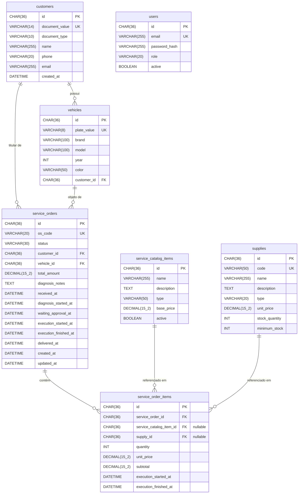

# Workshop Management System

MVP de back-end para gestão de oficina mecânica — FIAP Tech Challenge (Pós-Graduação em Arquitetura de Software, Turma 15SOAT).

## Visão Geral

Sistema integrado para controle de ordens de serviço (OS), clientes, veículos, catálogo de serviços, peças/insumos e rastreamento público de OS. Construído com Java 17, Spring Boot 3.2, MySQL e arquitetura em camadas baseada em DDD.

## Tecnologias

| Camada | Tecnologia |
|---|---|
| Linguagem | Java 17 |
| Framework | Spring Boot 3.2.5 |
| Segurança | Spring Security + JWT (JJWT 0.12) |
| Persistência | Spring Data JPA + Hibernate 6 + MySQL 8 |
| Migrations | Flyway |
| Documentação | SpringDoc OpenAPI 3 / Swagger UI |
| Testes | JUnit 5 + Testcontainers + JaCoCo |
| Build | Maven 3.9 |
| Container | Docker + Docker Compose |

---

## Pré-requisitos

- Java 17+
- Maven 3.9+
- Docker Desktop (para executar via Docker Compose ou para os testes de integração)

---

## Executando com Docker Compose

```bash
# Build e start (MySQL + aplicação)
docker-compose up --build

# Somente subir (sem rebuild)
docker-compose up

# Parar e remover os containers
docker-compose down

# Parar e remover containers + volume do banco
docker-compose down -v
```

A aplicação ficará disponível em `http://localhost:8080`.
O Flyway aplicará automaticamente as migrations V1 (schema), V2 (catálogo/peças) e V3 (usuários) na primeira inicialização.

---

## Executando localmente (sem Docker)

1. Suba apenas o banco de dados:
   ```bash
   docker-compose up mysql
   ```

2. Execute a aplicação:
   ```bash
   mvn spring-boot:run
   ```

---

## Variáveis de Ambiente

| Variável | Padrão | Descrição |
|---|---|---|
| `JWT_SECRET` | `dev-only-secret-must-be-at-least-64-characters-long-for-hs512-ok` | Chave secreta para assinar os tokens JWT. **Substitua em produção.** |
| `SPRING_PROFILES_ACTIVE` | `default` | Use `docker` quando executar via Docker Compose |

O perfil `docker` (`application-docker.yml`) configura a URL do banco para o container MySQL interno.

---

## Documentação da API (Swagger UI)

Com a aplicação em execução, acesse:

```
http://localhost:8080/swagger-ui.html
```

### Como autenticar no Swagger UI

1. Faça login em **POST /api/v1/auth/login** com um dos usuários abaixo
2. Copie o valor do campo `token` da resposta
3. Clique no botão **Authorize** (cadeado) no topo da página
4. Cole o token no campo **Value** (sem o prefixo `Bearer `) e clique em **Authorize**

A partir daí todos os endpoints protegidos enviarão o header `Authorization: Bearer <token>` automaticamente.

---

## Usuários Padrão (seed V3)

| E-mail | Senha | Role | Capacidades |
|---|---|---|---|
| `admin@workshop.com` | `workshop123` | `ROLE_ADMIN` | Acesso total |
| `consultor@workshop.com` | `workshop123` | `ROLE_CONSULTANT` | Criar OS, aprovar/rejeitar orçamento, entregar veículo, CRUD clientes/veículos |
| `mecanico@workshop.com` | `workshop123` | `ROLE_MECHANIC` | Iniciar diagnóstico, adicionar itens, registrar execução por item |
| `estoquista@workshop.com` | `workshop123` | `ROLE_STOCKIST` | Visualizar e ajustar estoque de peças/insumos |

---

## Fluxo Completo via Swagger

### 1. Autenticação
```
POST /api/v1/auth/login
Body: { "email": "admin@workshop.com", "password": "workshop123" }
→ Copie o token e autorize no Swagger
```

### 2. Cadastros iniciais (como consultor ou admin)
```
POST /api/v1/customers   → cadastrar cliente (use CPF ou CNPJ no campo documentNumber)
POST /api/v1/vehicles    → cadastrar veículo (vincule ao customerId obtido acima)
```

### 3. Abertura de OS (como consultor ou admin)
```
POST /api/v1/service-orders   → { "customerId": "...", "vehicleId": "..." }
→ OS criada com status RECEIVED e um osCode (ex: OS-2026-00001)
```

### 4. Diagnóstico (como mecânico)
```
PATCH /api/v1/service-orders/{id}/diagnosis/start
  → status: IN_DIAGNOSIS

POST /api/v1/service-orders/{id}/items
  → { "serviceCatalogItemId": "...", "quantity": 1 }   (para serviço)
  → { "supplyId": "...", "quantity": 2 }                (para peça/insumo)

POST /api/v1/service-orders/{id}/diagnosis/complete
  → { "diagnosisNotes": "Descrição do diagnóstico" }
  → status: WAITING_APPROVAL  (orçamento calculado automaticamente)
```

### 5. Aprovação do orçamento (como consultor ou admin)
```
PATCH /api/v1/service-orders/{id}/estimate/approve   → status: IN_EXECUTION
  (estoque decrementado automaticamente)

# Se o cliente rejeitar:
PATCH /api/v1/service-orders/{id}/estimate/reject    → volta para IN_DIAGNOSIS
```

### 6. Execução (como mecânico)
```
PATCH /api/v1/service-orders/{id}/items/{itemId}/start
PATCH /api/v1/service-orders/{id}/items/{itemId}/finish
  → quando o último item for concluído: status: FINISHED (automático)
```

### 7. Entrega (como consultor ou admin)
```
PATCH /api/v1/service-orders/{id}/deliver   → status: DELIVERED
```

### 8. Rastreamento público (sem autenticação)
```
GET /api/v1/tracking/{osCode}   → status simplificado para o cliente
```

### 9. Gestão de estoque (como estoquista ou admin)
```
GET  /api/v1/supplies?belowMinimum=true     → peças abaixo do estoque mínimo
PATCH /api/v1/supplies/{id}/stock           → { "adjustment": 10, "reason": "Reposição" }
```

---

## Executando os Testes

```bash
# Todos os testes (unitários + integração)
mvn test

# Apenas testes de integração
mvn test -Dtest=AuthIntegrationTest,ServiceOrderLifecycleIntegrationTest

# Relatório de cobertura JaCoCo
mvn verify
# Relatório em: target/site/jacoco/index.html
```

> Os testes de integração requerem Docker Desktop em execução. O Testcontainers sobe um container MySQL 8.0 automaticamente.

---

## Estrutura do Projeto

```
src/main/java/com/fiap/workshop/management/
├── domain/          # Entidades, Value Objects, interfaces de repositório, domain services
├── application/     # Use cases, DTOs (Commands e Responses)
├── infrastructure/  # JPA entities, adapters, segurança JWT, configurações
└── interfaces/rest/ # Controllers REST, GlobalExceptionHandler
```

O domínio é POJO puro — testável sem Spring. As entidades JPA ficam na camada de infraestrutura e são mapeadas para o domínio por adapters.

---

## Modelagem do Banco de Dados

### Escolha do Banco — MySQL 8

O MySQL foi escolhido pelos seguintes motivos:

| Critério | Justificativa |
|---|---|
| **Relacionamentos** | Os dados do sistema são fortemente relacionais: clientes possuem veículos, veículos possuem OS, OS possuem itens que referenciam serviços e peças. Um banco relacional é o modelo natural para esse domínio. |
| **ACID** | Transações ACID garantem consistência no controle de estoque (decremento na aprovação do orçamento) e nos cálculos financeiros dos totais das OS. |
| **Integridade referencial** | Chaves estrangeiras com `ENGINE=InnoDB` impedem, por exemplo, exclusão de clientes com OS em aberto ou veículos vinculados. |
| **Maturidade e ecossistema** | Amplo suporte no ecossistema Spring (Spring Data JPA + Hibernate), drivers estáveis, e fácil containerização com a imagem oficial `mysql:8.0`. |
| **Flyway** | Migrações versionadas garantem que o schema evolua de forma controlada e reproduzível em qualquer ambiente (local, CI, produção). |

### Diagrama Entidade-Relacionamento



> **Nota:** Um `service_order_item` representa serviço **ou** peça/insumo — as FKs `service_catalog_item_id` e `supply_id` são mutuamente opcionais, com a restrição `CHECK` garantindo que ao menos uma esteja preenchida.
