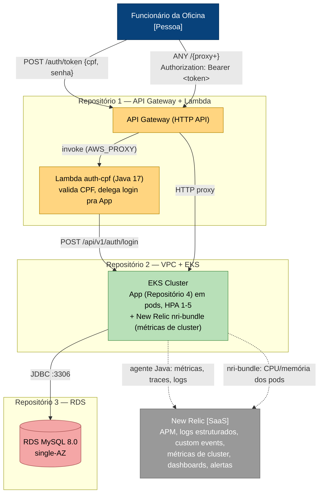
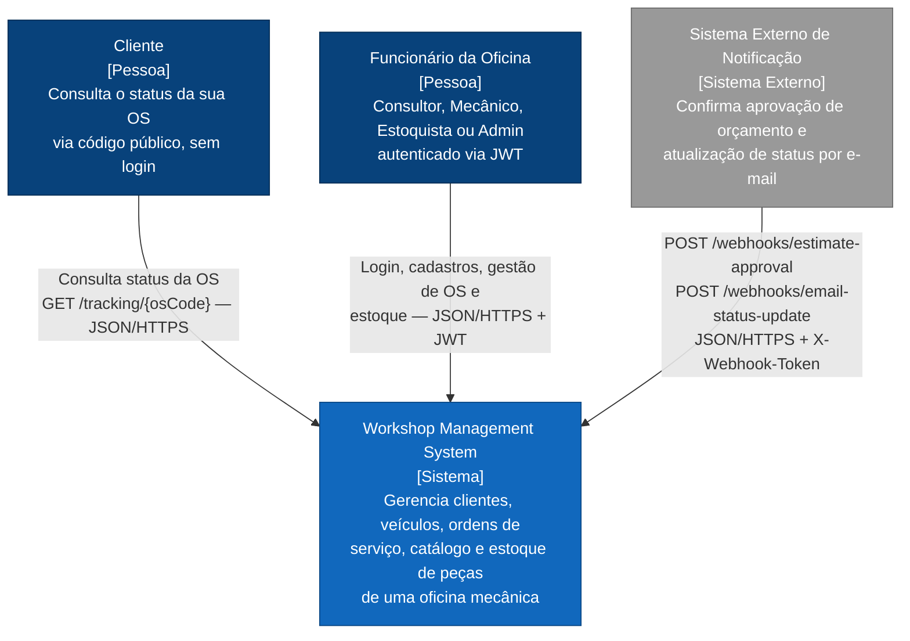
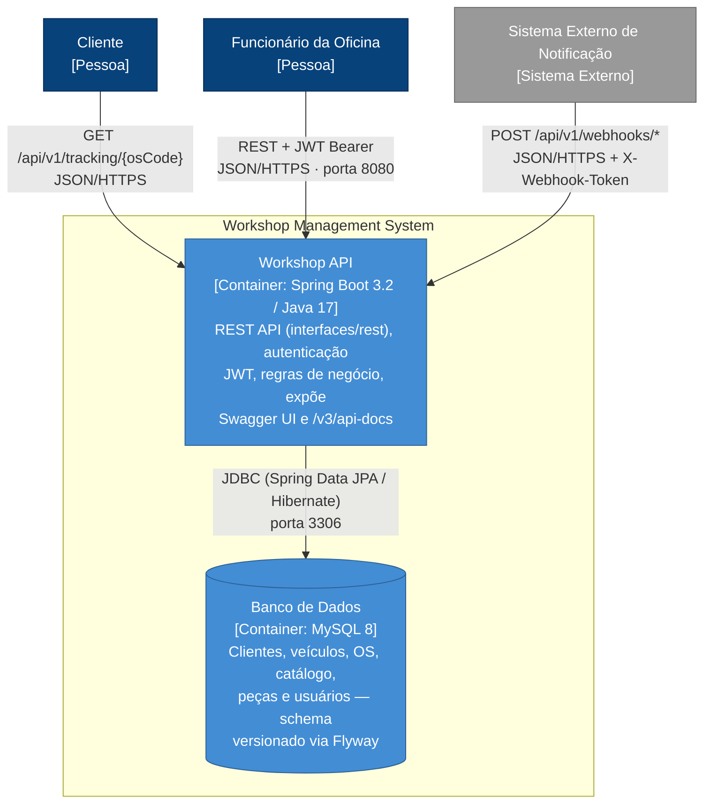
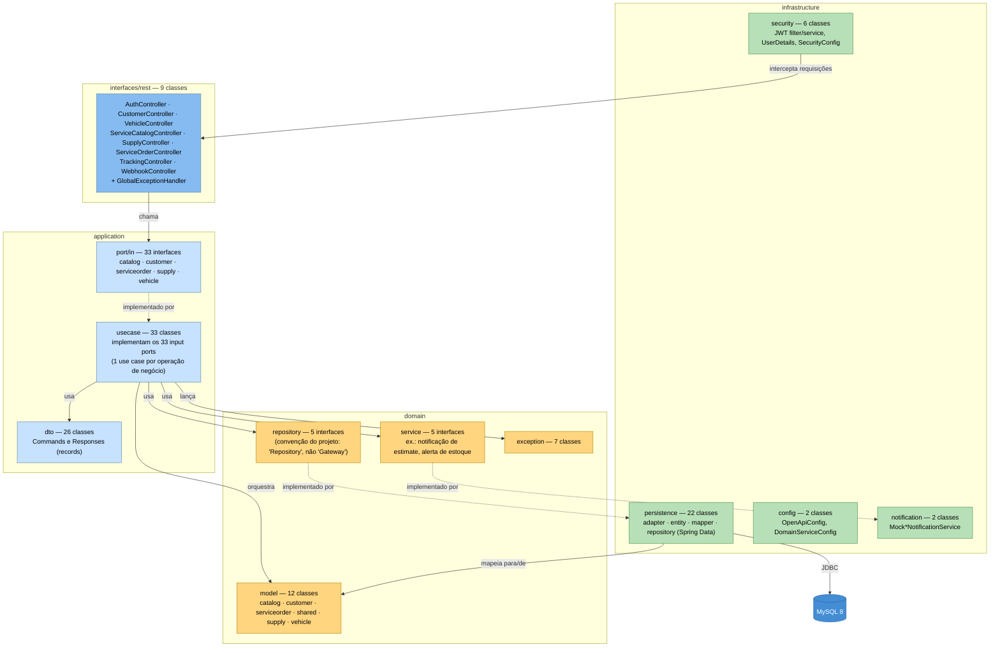

# Arquitetura

Documentação de arquitetura do Workshop Management System, usando o modelo **C4** (Contexto → Container → Componente) para descrever o sistema em níveis crescentes de detalhe. Para o modelo de dados (diagrama entidade-relacionamento e justificativa de escolha do MySQL), ver a seção [Modelagem do Banco de Dados](../README.md#modelagem-do-banco-de-dados) no README. Decisões técnicas relevantes estão registradas como [ADRs](adr/) e [RFCs](rfc/).

## Visão de Nuvem (Fase 3)

Como os 4 repositórios da Fase 3 se conectam em produção — API Gateway como porta de entrada única, autenticação via CPF, banco gerenciado e observabilidade:



Repositórios: [1 — Lambda + API Gateway](https://github.com/Adriana-Meyer/fiap-tech-challenge-API-gateway-function-serverless) · [2 — VPC + EKS](https://github.com/Adriana-Meyer/fiap-tech-challenge-kubernetes-infrastructure) · [3 — RDS](https://github.com/Adriana-Meyer/fiap-tech-challenge-database-infrastructure) · 4 — este repositório (App).

## Diagramas de Sequência

### Autenticação via CPF

```mermaid
sequenceDiagram
    actor F as Funcionário
    participant GW as API Gateway
    participant L as Lambda (auth-cpf)
    participant A as App (EKS)
    participant DB as RDS MySQL

    F->>GW: POST /auth/token {cpf, senha}
    GW->>L: invoke (AWS_PROXY)
    L->>L: valida checksum do CPF
    alt CPF mal formado
        L-->>GW: 400 Invalid CPF
        GW-->>F: 400 Invalid CPF
    else CPF com formato válido
        L->>A: POST /api/v1/auth/login {cpf, senha}
        A->>DB: SELECT * FROM users WHERE cpf = ?
        DB-->>A: usuário (ou vazio)
        alt credenciais inválidas ou usuário não existe
            A-->>L: 401 Unauthorized
            L-->>GW: 401 Unauthorized
            GW-->>F: 401 Unauthorized
        else credenciais válidas
            A->>A: gera JWT (JwtService)
            A-->>L: 200 {token}
            L-->>GW: 200 {token}
            GW-->>F: 200 {token}
        end
    end
    F->>GW: ANY /{proxy+}<br/>Authorization: Bearer &lt;token&gt;
    GW->>A: HTTP proxy
    A->>A: valida JWT + RBAC (Spring Security, como hoje)
    A-->>GW: 200 (recurso protegido)
    GW-->>F: 200
```

### Abertura de Ordem de Serviço

```mermaid
sequenceDiagram
    actor C as Consultor
    participant GW as API Gateway
    participant A as App (EKS)
    participant DB as RDS MySQL
    participant NR as New Relic

    C->>GW: POST /api/v1/service-orders {customerId, vehicleId}<br/>Authorization: Bearer &lt;token&gt;
    GW->>A: HTTP proxy
    A->>A: valida JWT + role CONSULTANT/ADMIN
    A->>DB: valida customer e vehicle existem
    DB-->>A: ok
    A->>DB: INSERT service_orders (status=RECEIVED, os_code=...)
    DB-->>A: ok
    A-->>NR: log estruturado (trace.id correlacionado)
    A-->>GW: 201 {osCode, status: RECEIVED}
    GW-->>C: 201
```

## Nível 1 — Contexto

Quem interage com o sistema e por quê:



## Nível 2 — Containers



**Monólito por decisão de escopo, não microsserviços**: um único container Spring Boot deployável. Swagger UI e o endpoint `/v3/api-docs` são rotas dentro desse mesmo container, não um serviço separado.

## Nível 3 — Componentes (dentro da Workshop API)

Mapeamento direto dos pacotes reais do projeto (contagem de classes atual):



As setas tracejadas ("implementado por") são o ponto central da Clean Architecture aplicada aqui: `domain/repository` e `domain/service` são abstrações; `infrastructure/persistence/adapter` e `infrastructure/notification` são as implementações, apontando **de volta** para dentro — a camada de infraestrutura depende do domínio, nunca o contrário (inversão de dependência).

## Decisões Técnicas

- **Clean Architecture com inversão de dependência**: `interfaces/rest` conhece só as interfaces de `application/port/in`; os casos de uso (`application/usecase`) implementam essas interfaces e dependem só de abstrações do domínio (`domain/repository`, `domain/service`); os adapters de infraestrutura implementam essas abstrações. O domínio (`domain/model`) é POJO puro, sem nenhuma dependência de framework — testável sem subir o contexto Spring.
- **`Repository`, não `Gateway`**: as interfaces de acesso a dados em `domain/repository` mantêm o nome `Repository` (não `Gateway`, como em alguns materiais de Clean Architecture) por consistência com a terminologia já consolidada em Spring Data/DDD no restante do código — a equivalência conceitual é a mesma, é só uma escolha de nomenclatura.
- **JWT stateless**: autenticação via `Authorization: Bearer <token>`, sem sessão no servidor — compatível com múltiplas réplicas do container por trás do HPA (ver [DEPLOYMENT.md](DEPLOYMENT.md)) sem necessidade de sticky sessions ou store de sessão compartilhado.
- **Monólito**: no escopo atual (uma API de gestão de oficina, um único time, um domínio coeso), um monólito modular bem estruturado em camadas entrega os mesmos benefícios de manutenibilidade de uma arquitetura distribuída, sem a complexidade operacional adicional (múltiplos deploys, comunicação de rede entre serviços, consistência eventual) que não se paga nesta escala.
