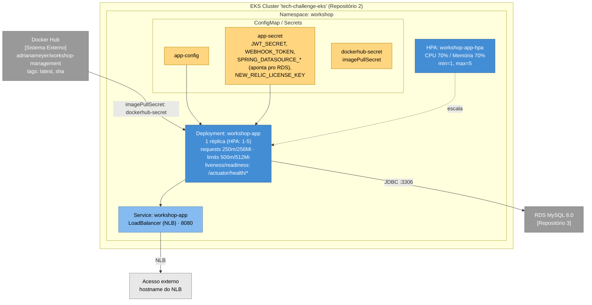

# Deploy e Infraestrutura

Como o Workshop Management System é conteinerizado, orquestrado e entregue na AWS real — Docker, Kubernetes (EKS), RDS e o pipeline de CI/CD.

A infraestrutura de cluster e banco não vive neste repositório: é provisionada via Terraform nos Repositórios [2](https://github.com/Adriana-Meyer/fiap-tech-challenge-kubernetes-infrastructure) (VPC + EKS) e [3](https://github.com/Adriana-Meyer/fiap-tech-challenge-database-infrastructure) (RDS MySQL). Este repositório só aplica os manifests da aplicação contra o cluster já existente.

## Infraestrutura (o que roda no cluster)

Topologia da aplicação depois do `deploy-aws.yml` (namespace, ConfigMap/Secrets, Deployment, HPA e o Service `LoadBalancer`):

> HPA depende de um metrics-server (ou equivalente) disponível no cluster para ler CPU/memória — isso é responsabilidade do Repositório 2, não deste repositório.

Manifestos em [`k8s/`](../k8s/): `00-namespace/`, `01-config/app-configmap.yaml`, `03-app/` (`deployment.yaml` + `hpa.yaml`) e `aws/service-loadbalancer.yaml`.

## Pipeline de CI/CD

GitHub Actions ([`.github/workflows/`](../.github/workflows/)):

- **`ci-cd.yml`** — roda em todo push/PR para `develop`/`main`: `build-and-test` (`mvn verify`, gate JaCoCo ≥ 80%) e, só em push (nunca em PR), `build-and-push-image` (build + push da imagem para o Docker Hub: `latest` + `sha`). Não faz nenhum deploy — só valida e publica a imagem.
- **`deploy-aws.yml`** — disparado manualmente (`workflow_dispatch`), com escolha entre `deploy`/`destroy` e ambiente (`homologacao`/`producao`). É o único caminho de deploy do projeto:
  1. `aws eks update-kubeconfig` contra o cluster do Repositório 2.
  2. Aplica `k8s/00-namespace/namespace.yaml` e `k8s/01-config/app-configmap.yaml`.
  3. Cria/atualiza o Secret `app-secret` a partir de GitHub Secrets — incluindo `SPRING_DATASOURCE_URL`/`_USERNAME`/`_PASSWORD` apontando para o RDS do Repositório 3 (chegam automaticamente via `gh secret set`, sem cópia manual) — e o `dockerhub-secret` (imagePullSecret).
  4. Aplica `k8s/03-app/deployment.yaml` + `hpa.yaml` e `k8s/aws/service-loadbalancer.yaml`.
  5. Espera o rollout, espera o hostname do NLB, faz smoke test em `/actuator/health`.
  - `action: destroy` desfaz na ordem inversa, deletando o Service **primeiro** (libera o NLB) antes do Deployment/HPA/secrets — importante para não deixar o NLB órfão (e cobrando) quando os Repositórios 2/3 forem destruídos depois.

Fica `workflow_dispatch` manual permanentemente, inclusive no estado final entregue: essa é a alternativa adotada para economizar os recursos limitados do Lab (sessão de ~4h, cluster/RDS não ficam sempre no ar) — o deploy em si é automático de ponta a ponta assim que disparado, sem nenhuma intervenção manual durante a execução; só o gatilho é manual, para ser acionado quando for conveniente e a sessão do Lab estiver ativa.

> Este projeto já rodou um caminho de deploy local via **kind** (cluster efêmero dentro do próprio runner) durante boa parte do desenvolvimento — validação gratuita e independente de sessão do Lab, enquanto o deploy real na AWS ainda não existia. Com o deploy real testado e validado de ponta a ponta, esse caminho foi removido (ver [ADR 0014](adr/0014-remove-kind-deploy-path.md)); o histórico de como funcionava está em [ADR 0005](adr/0005-terraform-kind-ci-validation.md).

## Segurança e Secrets

- Nenhum valor sensível é commitado. Os secrets do `app-secret` (`JWT_SECRET`, `WEBHOOK_TOKEN`, credenciais do RDS, `NEW_RELIC_LICENSE_KEY`) e do `dockerhub-secret` vêm de GitHub Secrets deste repositório, aplicados via `kubectl create secret ... --dry-run=client -o yaml | kubectl apply -f -` dentro do `deploy-aws.yml`.
- `k8s/aws/secret-aws.yaml.example` é só um template de referência (valores `CHANGE_ME`) — documenta a estrutura esperada, mas não é lido pelo workflow nem aplicado automaticamente.
- As credenciais do RDS (`RDS_DATASOURCE_URL`/`RDS_USERNAME`/`RDS_PASSWORD`) chegam automaticamente como Secrets deste repositório: o `terraform-apply.yml` do Repositório 3 faz `terraform output` e envia via `gh secret set` direto para cá (nunca aparecem em log).
- Credenciais AWS (`AWS_ACCESS_KEY_ID`/`AWS_SECRET_ACCESS_KEY`/`AWS_SESSION_TOKEN`) são as temporárias da sessão do AWS Academy Learner Lab — precisam ser atualizadas nos GitHub Secrets a cada nova sessão (~4h).
