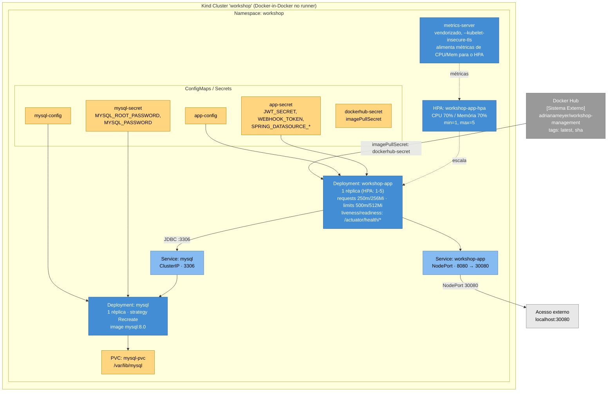
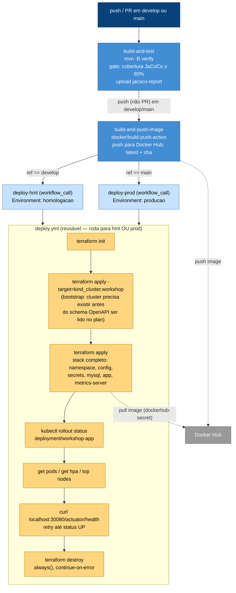

# Deploy e Infraestrutura

Como o Workshop Management System é conteinerizado, orquestrado e entregue continuamente — Docker, Kubernetes, Terraform e o pipeline de CI/CD.

## Infraestrutura

Topologia do cluster provisionado (namespace, ConfigMaps/Secrets, Deployments, Services, HPA e o add-on de métricas):



Manifestos em [`k8s/`](../k8s/), organizados em estágios ordenados de aplicação: `00-namespace` → `01-config` → `02-mysql` → `03-app`.

## Provisionamento via Terraform

Todo o cluster é provisionado declarativamente a partir de [`infra/`](../infra/) — nenhum `kubectl apply` manual:

- **`main.tf`**: providers `tehcyx/kind` (cria o cluster) e o provider oficial `hashicorp/kubernetes` (aplica os recursos).
- **`cluster.tf`**: `kind_cluster.workshop`, com `extra_port_mappings` expondo a porta `30080` do host.
- **`variables.tf`**: 6 variáveis sensíveis, sem valor default — `mysql_root_password`, `mysql_password`, `jwt_secret`, `webhook_token`, `dockerhub_username`, `dockerhub_password`.
- **`secrets.tf`**: cria os 3 Secrets (`app-secret`, `mysql-secret`, `dockerhub-secret`) como recursos nativos `kubernetes_secret`, direto a partir das variáveis acima — nenhum valor real chega a ser escrito em disco ou commitado.
- **`manifests.tf`**: aplica **todos** os arquivos de `/k8s` (namespace, config, MySQL e app) via `kubernetes_manifest` (recurso genérico do provider oficial) lendo os YAML reais com `yamldecode(file(...))`, em vez de reescrever cada recurso como HCL nativo — evita duplicar a mesma definição em dois formatos diferentes. A ordem de aplicação (namespace → config → mysql → app) é garantida por `depends_on` encadeado entre os 4 estágios.
- **`metrics-server.tf`**: mesmo padrão genérico, aplicando os manifestos vendorizados do metrics-server (com o patch `--kubelet-insecure-tls`, necessário porque o kind não tem certificados TLS válidos entre os nós).

### Bootstrap em duas passadas

O recurso `kubernetes_manifest` precisa consultar o schema OpenAPI do cluster já no momento do `terraform plan` — o que cria uma dependência circular na primeira execução, quando o cluster ainda não existe. Por isso, a criação exige duas passadas:

```bash
cd infra
terraform init

# 1ª passada: só o cluster (resolve a dependência circular)
terraform apply -target=kind_cluster.workshop

# 2ª passada: todo o resto (namespace, secrets, config, mysql, app, metrics-server)
terraform apply
```

## Pipeline de CI/CD

GitHub Actions ([`.github/workflows/`](../.github/workflows/)): `ci-cd.yml` orquestra o pipeline e `deploy.yml` é um workflow reutilizável (`workflow_call`) compartilhado pelos dois ambientes simulados — **Homologação** (branch `develop`) e **Produção** (branch `main`).



**Pontos importantes do desenho:**
- `build-and-test` roda em todo push e PR para `develop`/`main` — feedback rápido, sem custo de imagem/deploy.
- `build-and-push-image` e os dois `deploy-*` só rodam em **push** (nunca em PR) para `develop`/`main` — evita builds/deploys desnecessários durante revisão de código.
- O cluster kind roda **dentro do próprio runner** do GitHub Actions (o provider `tehcyx/kind` usa a lib Go `sigs.k8s.io/kind` diretamente, sem depender de nenhum binário externo — só precisa do Docker, que já vem pronto no runner `ubuntu-latest`) — é efêmero, existe só durante o job, e é destruído ao final (`terraform destroy`). O objetivo é provar que a automação de ponta a ponta funciona, não manter um ambiente ativo.
- `homologacao` e `producao` usam exatamente a mesma imagem e o mesmo código Terraform — a diferença entre os dois ambientes está só em qual branch dispara qual GitHub Environment.

## Rodando localmente

Mesmo roteiro usado para validar a infraestrutura manualmente:

```bash
cd infra
terraform init
terraform apply -target=kind_cluster.workshop
terraform apply

kubectl get pods -n workshop
kubectl get hpa -n workshop
curl http://localhost:30080/actuator/health

terraform destroy
```

## Segurança e Secrets

- As 6 variáveis sensíveis (`mysql_root_password`, `mysql_password`, `jwt_secret`, `webhook_token`, `dockerhub_username`, `dockerhub_password`) não têm valor default no `variables.tf` — precisam ser fornecidas via `TF_VAR_<nome>` no ambiente, tanto localmente quanto no pipeline (onde vêm dos GitHub Actions Secrets do repositório).
- `k8s/secret.yaml.example` e `k8s/mysql-secret.yaml.example` são só templates de referência (valores `CHANGE_ME`) — documentam a estrutura esperada caso alguém precise criar um Secret manualmente via `kubectl`, mas não são lidos pelo Terraform nem aplicados automaticamente.
- `infra/.terraform/` e `infra/terraform.tfstate*` estão no `.gitignore` — o state do Terraform armazena os valores dos secrets em texto plano, então nunca é commitado.
