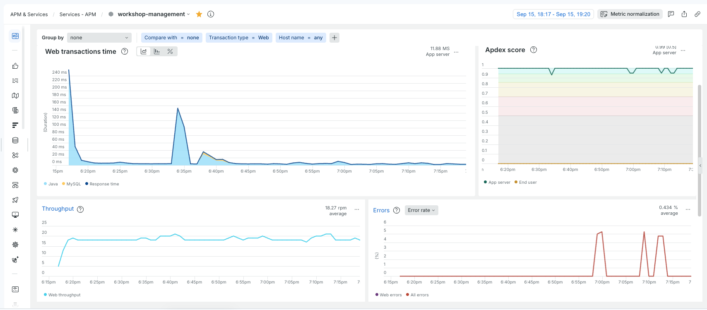
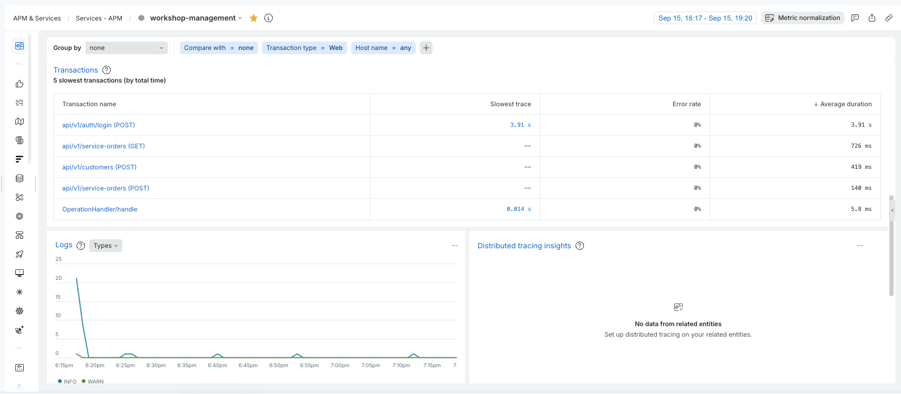
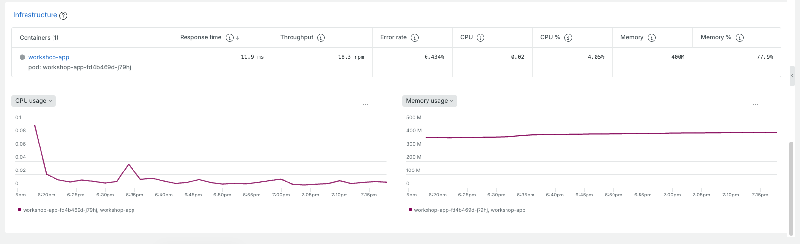
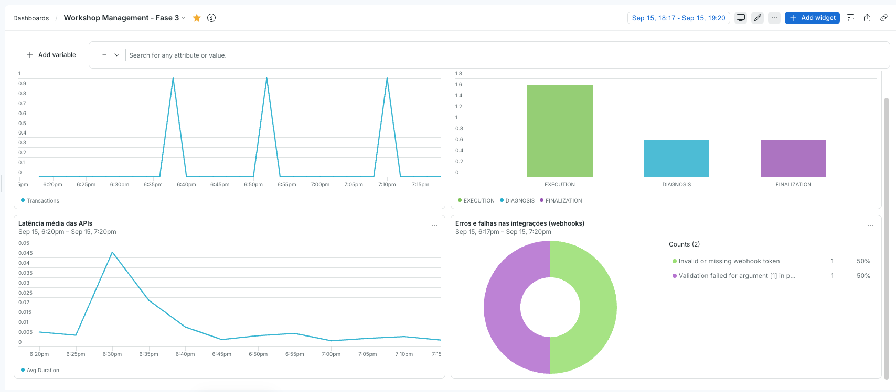
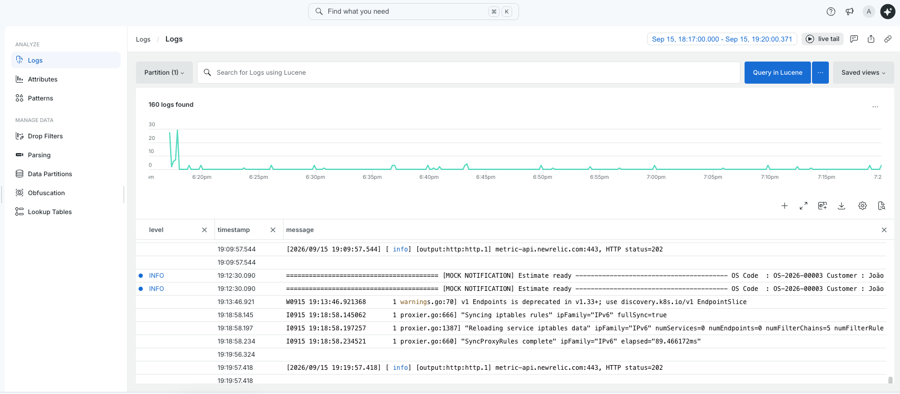
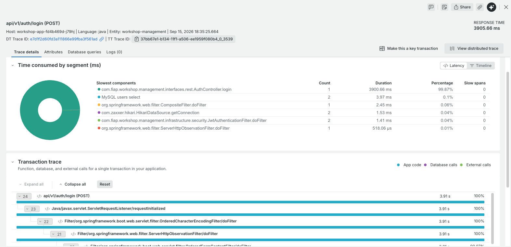
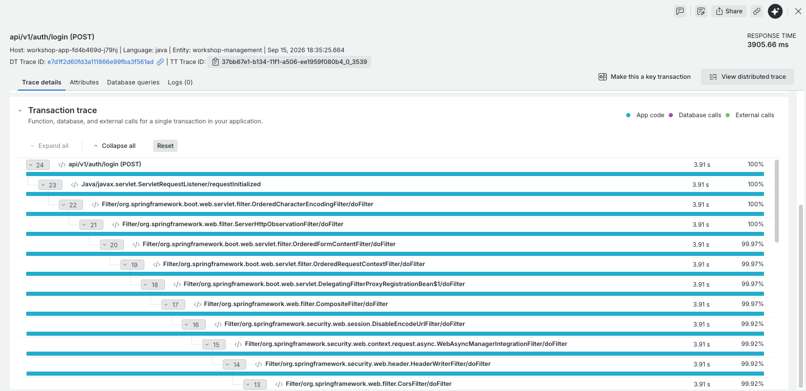
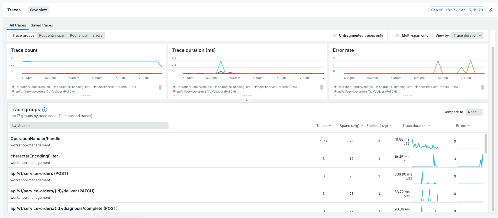

# Observabilidade (New Relic)

Detalhamento do que o agente New Relic ([README](../README.md#observabilidade-new-relic)) expõe, com prints reais do New Relic como exemplo de cada recurso.

## APM automático

Vem de graça com o agente Java, sem nenhuma instrumentação manual: tempo de resposta, Apdex, throughput e taxa de erro por transação web, além da lista das transações mais lentas.

## Métricas de infraestrutura do pod

CPU e memória do container `workshop-app`, correlacionadas automaticamente com o pod do Kubernetes pela mesma instrumentação.

## Dashboard customizado "Workshop Management - Fase 3"

Os 4 widgets construídos para os requisitos de observabilidade da Fase 3: volume de transações, tempo médio por status da OS (via o custom event `ServiceOrderStatusDuration`, ver README), latência média das APIs e erros/falhas de integração de webhook.

## Logs estruturados e correlacionados

Logs em JSON (`logstash-logback-encoder`) com `trace.id`/`span.id` injetados automaticamente no MDC — cada linha de log já chega correlacionada com o trace da requisição que a gerou, sem código de correlação manual.

## Traces distribuídos

Rastreamento de uma requisição por todas as camadas que ela passa (filtros do Spring Security, chamadas ao banco, código da aplicação), com o tempo gasto em cada segmento.

